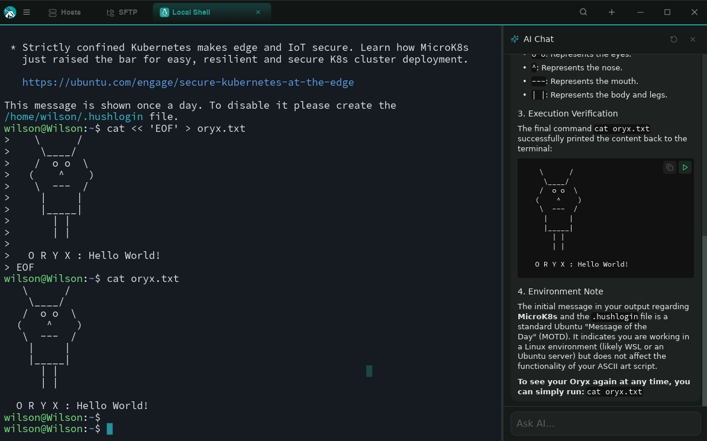
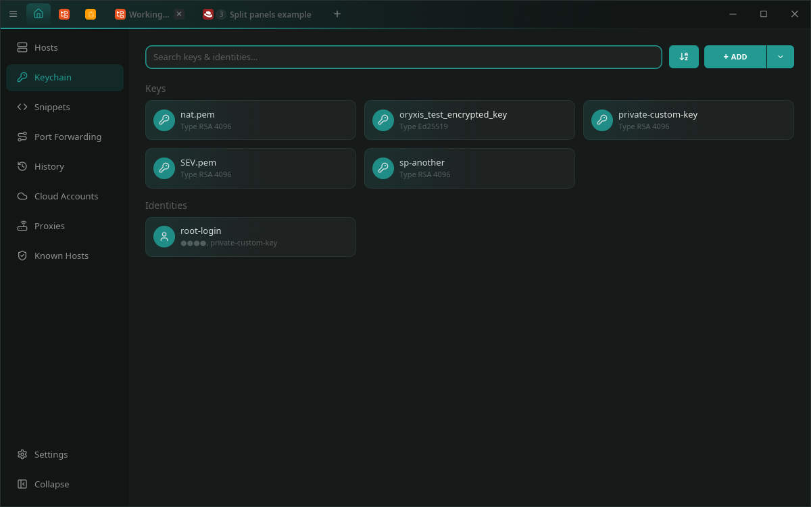
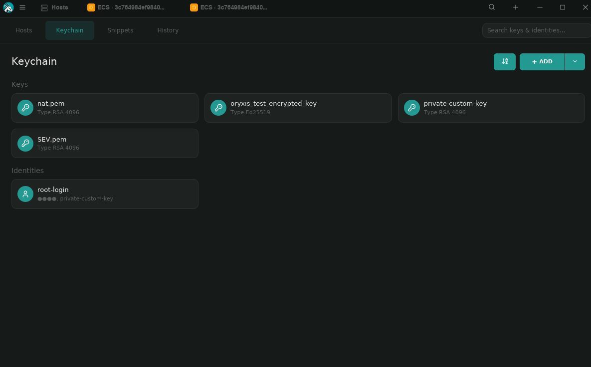
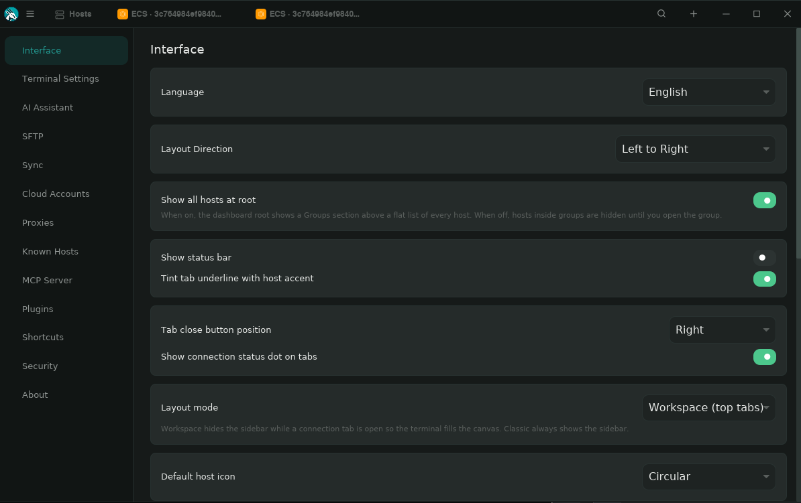

<p align="center">
  
</p>

<h1 align="center">Oryxis</h1>

<p align="center">
  A modern SSH client built entirely in Rust — fast, encrypted, native.
</p>

<p align="center">
  <a href="https://github.com/wilsonglasser/oryxis/actions/workflows/ci.yml"></a>
  <a href="https://github.com/wilsonglasser/oryxis/releases/latest"></a>
  
  
  <a href="LICENSE"></a>
  <a href="https://oryxis.app"></a>
  <a href="https://ko-fi.com/wilsonglasser"></a>
  <a href="https://buymeacoffee.com/wilsonglasser"></a>
</p>

<p align="center">
  🌐 English · Português · Español · Français · Deutsch · Italiano · 中文 · 日本語 · Русский
</p>

---

## Download

**Windows (winget):**

```powershell
winget install WilsonGlasser.Oryxis
```

Pre-built binaries are also available on the [Releases](https://github.com/wilsonglasser/oryxis/releases/latest) page:

| Platform | Architecture | Download |
|----------|-------------|----------|
| Linux | x86_64 | [`oryxis-linux-x86_64.tar.gz`](https://github.com/wilsonglasser/oryxis/releases/latest/download/oryxis-linux-x86_64.tar.gz) · [`.deb`](https://github.com/wilsonglasser/oryxis/releases/latest/download/oryxis-linux-x86_64.deb) · [`.AppImage`](https://github.com/wilsonglasser/oryxis/releases/latest/download/oryxis-linux-x86_64.AppImage) |
| Linux | ARM64 | [`oryxis-linux-aarch64.tar.gz`](https://github.com/wilsonglasser/oryxis/releases/latest/download/oryxis-linux-aarch64.tar.gz) · [`.deb`](https://github.com/wilsonglasser/oryxis/releases/latest/download/oryxis-linux-aarch64.deb) · [`.AppImage`](https://github.com/wilsonglasser/oryxis/releases/latest/download/oryxis-linux-aarch64.AppImage) |
| macOS | Apple Silicon | [`oryxis-macos-aarch64.tar.gz`](https://github.com/wilsonglasser/oryxis/releases/latest/download/oryxis-macos-aarch64.tar.gz) |
| Windows | x86_64 | [`oryxis-setup-x86_64.exe`](https://github.com/wilsonglasser/oryxis/releases/latest/download/oryxis-setup-x86_64.exe) (installer) |
| Windows | x86_64 | [`oryxis-windows-x86_64.zip`](https://github.com/wilsonglasser/oryxis/releases/latest/download/oryxis-windows-x86_64.zip) (portable) |
| Windows | ARM64 | [`oryxis-windows-aarch64.zip`](https://github.com/wilsonglasser/oryxis/releases/latest/download/oryxis-windows-aarch64.zip) (portable) |

---

## What is Oryxis?

Oryxis is an open-source alternative to [Termius](https://termius.com/) — a desktop SSH client with a modern UI, an encrypted vault for credentials, and a Termius-inspired design. No Electron, no webview, no cloud servers. Just a single native binary.

### Why?

Most SSH clients are either powerful but ugly (PuTTY), pretty but Electron-heavy (Termius, Tabby), or terminal-only (OpenSSH). Oryxis aims to be all three: **beautiful, fast, and native**.

## Screenshots

<p align="center">
  
</p>
<p align="center">
  <em>Hosts — cards grid with folders, distro auto-detection, inline quick connect</em>
</p>

<p align="center">
  
</p>
<p align="center">
  <em>SFTP browser — drag &amp; drop uploads, multi-select transfers, edit-in-place, parallel channels</em>
</p>

<p align="center">
  
</p>
<p align="center">
  <em>Keychain — keys and reusable identities side by side, linked to multiple hosts</em>
</p>

<p align="center">
  
</p>
<p align="center">
  <em>Streaming AI sidebar — token-by-token responses, per-code-block Copy / Play, risk-aware tool gate</em>
</p>

<p align="center">
  
</p>
<p align="center">
  <em>12 global themes with palette previews — Oryxis, Termius, Darcula, Dracula, Monokai, Nord, Solarized&hellip;</em>
</p>

<p align="center">
  
</p>
<p align="center">
  <em>P2P sync over QUIC — LAN via mDNS, internet via STUN, pairing &amp; optional relay</em>
</p>

## Features

### SSH & Connectivity
- **Smart auto-authentication** — Automatically tries key, agent, password, and keyboard-interactive in order.
- **Full SSH pipeline** — Direct, SOCKS4/5, HTTP CONNECT, ProxyCommand, jump host chaining, and local port forwarding via [russh 0.60](https://github.com/warp-tech/russh).
- **SSH agent forwarding** — Per-host opt-in (`ForwardAgent yes` from `ssh_config` is honored on import). Bridges the local ssh-agent socket through the channel so you can `ssh hostB` from inside hostA without staging keys remotely. Unsolicited forward channels are rejected.
- **RSA SHA-2 support** — Modern rsa-sha2-256/512 signing.
- **Connection progress** — Step-by-step indicator with detailed error messages.
- **TOFU host key verification** — Fingerprints saved on first connect, rejected if key changes.
- **Integration tests** — Real OpenSSH server containers via testcontainers (`cargo test -p oryxis-ssh -- --ignored`) covering password auth, ed25519 pubkey, exec exit codes, stdout/stderr separation, PTY round-trip, resize, agent forwarding on/off.

### Terminal
- **Embedded emulator** — [alacritty_terminal 0.26](https://github.com/alacritty/alacritty) with 256-color, truecolor, mouse selection, scrollback.
- **Syntax highlighting** — IPs (magenta), URLs (blue), file paths (cyan) auto-detected.
- **Bold-to-bright colors** — Bold text uses vivid bright ANSI variants.
- **6 terminal themes** — Oryxis Dark, Hacker Green, Dracula, Solarized Dark, Monokai, Nord.
- **Configurable font size** — 10-24px, adjustable in Settings.
- **Session recording** — Full terminal output saved to vault, viewable in History.

### SFTP File Browser
- **Dual-pane layout** — Local on the left, remote on the right, columnar (name / modified / size) with click-to-sort.
- **Drag-and-drop uploads** — Drop files from any OS file manager onto the remote pane (or onto a specific folder row to upload there).
- **Internal drag** — Drag rows from one pane to the other to upload/download; ghost preview follows the cursor.
- **Multi-select** — Ctrl/Cmd-click toggles, Shift-click range, plain click replaces. Right-click on a selection runs Delete / Download / Duplicate / Upload as a batch.
- **Edit-in-place** — Right-click → Edit downloads to a temp file, opens your OS default editor, watches for save (mtime poll), prompts to upload back.
- **Properties dialog** — Per-row chmod with R/W/X grid for owner / group / others, file size, mtime, owner uid/gid.
- **Overwrite handling** — Replace / Replace if different size / Duplicate / Cancel modal on collision; "Apply to remaining" sticky decision for multi-file transfers.
- **Configurable parallelism** — 1–8 concurrent SFTP channels per session for fast bulk transfers.
- **`rm -rf` over exec** — Recursive remote delete via SSH exec instead of slow per-file SFTP, single round-trip.
- **Live progress bar** — Per-file count, current item, percent, cancel button.
- **Tunable timeouts** — Connect / auth / channel-open / per-operation timeouts, all live-applicable from Settings → SFTP.

### AI Chat Assistant
- **Integrated AI sidebar** — Collapsible chat panel per terminal session.
- **Streaming responses** — Tokens land in the bubble as the model emits them via SSE (Anthropic, OpenAI, Gemini, OpenAI-compat). Markdown re-renders progressively as each delta arrives.
- **Bash tool execution** — AI can run commands in the active terminal and analyze output. Tool follow-ups stream through the same pipeline (poll terminal for stable output → stream the next round).
- **Smart output capture** — Polls terminal until output stabilizes (no fixed timeouts).
- **Multiple providers** — Anthropic (Claude), OpenAI (GPT), Google Gemini, or custom OpenAI-compatible endpoints.
- **Terminal context** — AI receives the last ~50 lines of terminal output for context.
- **Custom system prompt** — Add additional instructions in Settings.

### Identity System
- **Reusable credentials** — Create Identities (username + password + key) linked to multiple hosts.
- **Autocomplete** — Type in username field to see matching identities, click to link.
- **Keychain view** — Keys and Identities side by side with search, edit, context menus.

### Themes & Internationalization
- **12 global themes** — Oryxis Dark / Light, Termius, Darcula, Islands Dark, Dracula, Monokai, Hacker Green, Nord, Nord Light, Solarized Light, Paper Light. Changes entire UI instantly.
- **Per-theme button colors** — Every theme defines a `button_bg` / `button_text` pair so primary CTAs (`+ HOST`, `New Snippet`, modal Save, etc.) keep readable foregrounds across the whole palette.
- **WCAG contrast guards** — Unit tests iterate every theme and assert text-on-surface and button label contrast against AA bounds; bad picks fail CI before they ship.
- **9 languages** — English, Português (Brasil), Español, Français, Deutsch, Italiano, 中文, 日本語, Русский.
- **Floating overlay menus** — Context menus float over content with click-outside-to-dismiss.
- **Theme + language honored on the lock screen** — Settings live in the plaintext settings table, so the unlock / setup screen already renders in the chosen theme before the vault is open.

### Vault & Security
- **No password by default** — Opens instantly. Enable master password in Settings.
- **Argon2id + ChaCha20Poly1305** — Industry-standard encryption.
- **Per-field encryption** — Each secret has unique 32-byte salt + 12-byte nonce.
- **Re-encryption** — All secrets re-encrypted when password changes.
- **Vault reset** — "Forgot password?" option to destroy and recreate vault.
- **No telemetry** — No data leaves your machine.

### Export / Import
- **Single encrypted file** — Export your entire vault as a `.oryxis` file protected with a password.
- **Selective export** — Choose whether to include SSH private keys or only host configurations.
- **Smart merge** — Import merges by UUID, updating only records that are newer (LWW).

### MCP Server
- **AI integration** — Expose your SSH hosts to AI assistants (Claude Code, etc.) via the [Model Context Protocol](https://modelcontextprotocol.io/).
- **5 tools** — `list_hosts`, `get_host`, `ssh_execute`, `list_groups`, `list_keys`.
- **Per-host control** — Toggle MCP exposure per connection in the host editor.
- **Disabled by default** — Enable in Settings > Security.
- **Non-interactive SSH exec** — Execute commands and get stdout/stderr/exit_code without PTY.

### P2P Sync
- **Decentralized** — Sync vault data between devices over QUIC (quinn), no cloud dependency.
- **LAN discovery** — Automatic peer discovery via mDNS on the local network.
- **Internet discovery** — Lightweight signaling server (Cloudflare Workers) for NAT traversal with STUN.
- **Pairing** — 6-digit code for initial device introduction, then Ed25519 key authentication.
- **E2E encrypted** — Sync payloads encrypted with shared secret (X25519 + ChaCha20Poly1305).
- **Auto or manual** — Configurable sync mode with adjustable interval.
- **Optional relay** — User-configurable relay URL for symmetric NAT environments.

### UI / UX
- **Native GPU-accelerated UI** — [Iced 0.14](https://iced.rs) (wgpu backend).
- **Termius-inspired design** — Card grid, slide-in editors, sidebar navigation.
- **Folder organization** — Group hosts into folders with breadcrumb navigation.
- **Search** — Filter hosts and keys by name.
- **Empty states** — Centered onboarding screens.
- **Multi-tab sessions** — SSH and local shell sessions in tabs.
- **Snippets** — Save and execute commands with one click.
- **Settings sidebar** — Terminal, SFTP, AI, Theme, Shortcuts, Security, Sync, About sections.
- **Persistent settings** — All preferences stored in the encrypted vault and restored on next launch.
- **Tab overflow** — Tabs compact down to a min width as the bar fills (active stays at natural width). Beyond that, the strip becomes horizontally scrollable (mouse wheel scrolls), and a `⋯` button surfaces a "Jump to" modal (`Ctrl+J`) listing all open tabs + Quick connect entries.

## Architecture

```
+----- Iced Application (wgpu) ---------------------------------+
|                                                               |
|  Sidebar -- Navigation (Hosts, Keys, Snippets, etc.)          |
|  Tab Bar -- Open terminal sessions                            |
|  Content -- Grid cards / terminal canvas / AI chat sidebar    |
|  Panels  -- Slide-in editors (Host, Key, Identity)            |
|  Overlay -- Floating context menus                            |
|                                                               |
+---------------------------------------------------------------+
|  oryxis-ssh               |  oryxis-vault                     |
|  (russh 0.60 + auto-auth  |  (SQLite + Argon2id +             |
|   + jump hosts + proxy    |   ChaCha20Poly1305 +              |
|   + RSA-SHA2 + exec)      |   Export/Import .oryxis)          |
+---------------------------+-----------------------------------+
|  oryxis-sync              |  oryxis-mcp                       |
|  (quinn QUIC + mDNS +     |  (JSON-RPC 2.0 stdio,             |
|   STUN + Ed25519/X25519   |  list/get/exec SSH hosts          |
|   + LWW conflict)         |   for AI assistants)              |
+---------------------------+-----------------------------------+
|  oryxis-terminal          |  oryxis-core                      |
|  (alacritty_terminal 0.26 |  (Connection, Key, Identity,      |
|   + syntax highlight      |   Group, Snippet, KnownHost,      |
|   + 6 themes + recording) |   LogEntry)                       |
+---------------------------------------------------------------+
```

| Crate | Purpose |
|-------|---------|
| `oryxis-app` | Iced app, views, themes, i18n, AI chat, overlay system |
| `oryxis-core` | Shared types — Connection, SshKey, Identity, Group, Snippet, KnownHost, LogEntry |
| `oryxis-terminal` | Terminal widget (alacritty + canvas + PTY + syntax highlight + 6 themes) |
| `oryxis-ssh` | SSH engine — auto-auth, jump hosts, SOCKS/HTTP proxy, ProxyCommand, TOFU, RSA-SHA2 |
| `oryxis-vault` | Encrypted vault — SQLite + Argon2id + ChaCha20Poly1305 + Identity + Session logs + Export/Import |
| `oryxis-sync` | P2P sync engine — QUIC (quinn) + mDNS + STUN + signaling + Ed25519/X25519 + LWW conflict resolution |
| `oryxis-mcp` | MCP server binary — JSON-RPC 2.0 over stdio, exposes SSH hosts to AI assistants |

## Tech Stack

| Layer | Technology |
|-------|-----------|
| UI | Iced 0.14 (wgpu, GPU-accelerated) |
| Icons | Bootstrap Icons (iced_fonts) |
| Terminal | alacritty_terminal 0.26 |
| SSH | russh 0.60 (async, pure Rust, RSA-SHA2) |
| AI | reqwest + Anthropic/OpenAI/Gemini APIs |
| MCP | JSON-RPC 2.0 over stdio |
| P2P Sync | quinn (QUIC), mDNS, STUN, Ed25519/X25519 |
| Encryption | Argon2id + ChaCha20Poly1305 |
| Storage | SQLite (rusqlite) |
| Clipboard | arboard |
| File picker | rfd (native OS dialog) |
| Async | Tokio |

## Building from Source

### Prerequisites

- Rust 1.90+ (install via [rustup](https://rustup.rs/))

**Linux:**
```bash
sudo apt install -y build-essential pkg-config libssl-dev libgtk-3-dev libwayland-dev libxkbcommon-dev
```

**macOS:** Xcode Command Line Tools (`xcode-select --install`)

**Windows:** Visual Studio Build Tools with C++ workload

### Build & Run

```bash
git clone https://github.com/wilsonglasser/oryxis.git
cd oryxis
cargo run            # Debug
cargo build --release # Release
cargo test --workspace
```

## Usage

1. **First launch** — Choose to set a master password or continue without one
2. **Add hosts** — Click `+ HOST`, fill in hostname and credentials
3. **Identities** — Create reusable credential bundles in the Keychain
4. **Connect** — Click a host card to open an SSH session
5. **AI Chat** — Enable in Settings > AI, click chat bubble in terminal to ask questions
6. **Export/Import** — Settings > Security to export vault or import from another device
7. **MCP Server** — Enable in Settings > Security, configure in your AI client
8. **P2P Sync** — Settings > Sync to pair devices and sync vault data
9. **Themes** — Switch in Settings (Oryxis Dark, Light, Dracula, Nord)
10. **Language** — Change in Settings > Theme (9 languages available)

### MCP Server Setup

The MCP server (`oryxis-mcp`) exposes your SSH hosts to AI assistants like Claude Code.

1. Enable MCP in Settings > Security
2. Add to your Claude Code config (`~/.claude.json`):

```json
{
  "mcpServers": {
    "oryxis": {
      "command": "oryxis-mcp",
      "env": {
        "ORYXIS_VAULT_PASSWORD": "your-vault-password"
      }
    }
  }
}
```

If your vault has no password, omit the `env` field.

### Signaling Server (for P2P Sync over the internet)

P2P Sync uses a lightweight signaling server on Cloudflare Workers for device discovery over the internet. LAN sync works without it (via mDNS).

To deploy your own signaling server:

```bash
cd signaling-worker
npm install -g wrangler
wrangler login
wrangler kv namespace create SYNC_KV
# Copy the ID from the output into wrangler.jsonc
wrangler secret put SIGNALING_TOKEN
# Enter your token (same value as ORYXIS_SIGNALING_TOKEN in .env)
wrangler deploy
```

Then set your Worker URL in Settings > Sync > Advanced > Signaling Server.

The signaling server only stores `device_id -> IP:port` with a 5-minute TTL. It never sees encryption keys or vault data. All requests require a Bearer token to prevent unauthorized access.

### Keyboard Shortcuts

| Shortcut | Action |
|----------|--------|
| `Ctrl+Shift+C` | Copy from terminal |
| `Ctrl+Shift+V` | Paste to terminal |
| `Ctrl+Shift+W` | Close tab |
| `Ctrl+1...9` | Switch to tab 1-9 |
| `Ctrl+L` | Open local terminal |
| `Ctrl+N` | New host |

## Security

- **Argon2id + ChaCha20Poly1305** — Memory-hard KDF + AEAD encryption
- **Per-field encryption** — Unique 32-byte salt + 12-byte nonce per secret
- **Optional master password** — Disabled by default, enable in Settings
- **TOFU** — Server fingerprints verified on every connection
- **Pure Rust** — No C dependencies in crypto path
- **No telemetry** — No data leaves your machine
- **AI keys encrypted** — API keys stored encrypted in vault
## Roadmap

| Version | Status | Scope |
|---------|--------|-------|
| **v0.1** | **Released** | SSH, vault, keys, identities, themes, i18n, AI chat, session recording |
| **v0.2** | **Released** | Export/Import, MCP server, P2P sync, port forwarding |
| **v0.3** | **Released** | SFTP browser (dual-pane, drag/drop, multi-select, edit-in-place, properties, queue), tab overflow + jump-to modal |
| **v0.4** | **Released** | Streaming AI responses, SSH agent forwarding, SSH integration tests, `app.rs` / `dispatch.rs` split into per-domain modules, theme contrast pass + per-theme button colors |
| **v0.5** | Planned | Split panes, biometric unlock, custom themes |

## Contributing

Contributions welcome. Open an issue to discuss before submitting large PRs.

## License

[AGPL-3.0](LICENSE) — Free and open-source forever.

---

<p align="center">
  Built with Rust, for people who live in the terminal.
</p>
