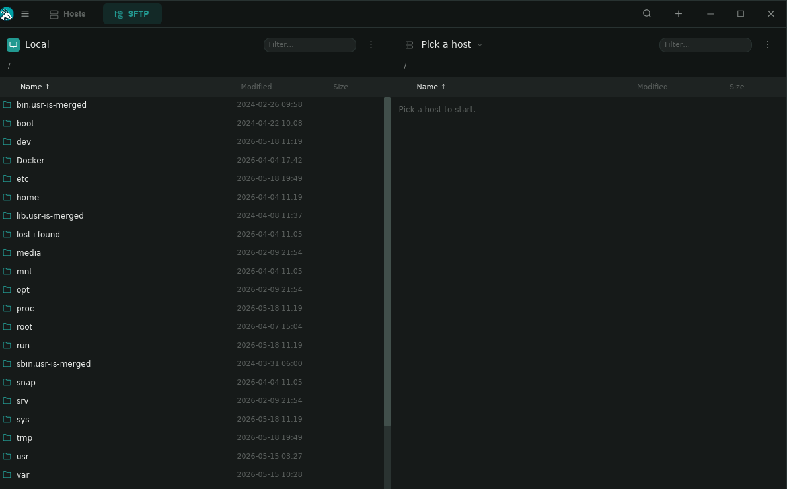
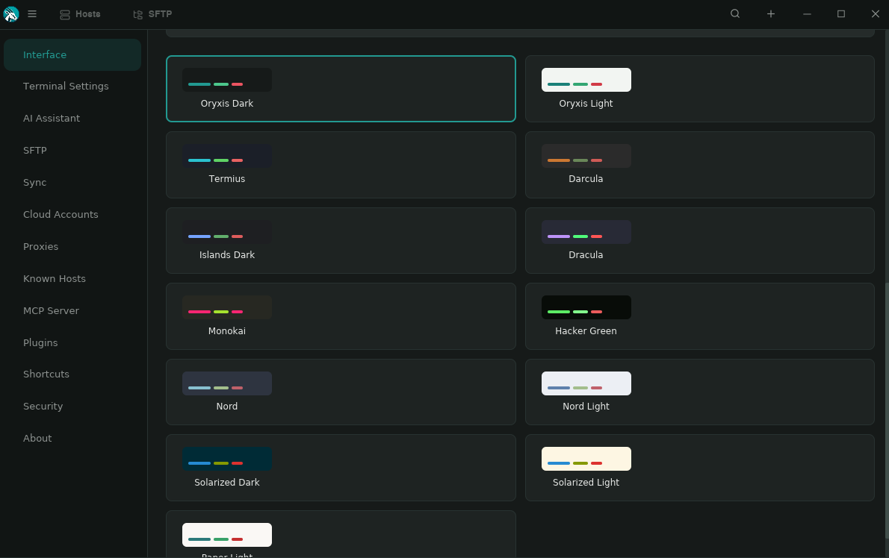

<p align="center">
  
</p>

<h1 align="center">Oryxis</h1>

<p align="center">
  A modern SSH client built entirely in Rust. Fast, encrypted, native.
</p>

<p align="center">
  <a href="https://github.com/wilsonglasser/oryxis/actions/workflows/ci.yml"></a>
  <a href="https://github.com/wilsonglasser/oryxis/releases/latest"></a>
  
  
  <a href="LICENSE"></a>
  <a href="https://oryxis.app"></a>
  <a href="https://ko-fi.com/wilsonglasser"></a>
  <a href="https://buymeacoffee.com/wilsonglasser"></a>
</p>

<p align="center">
  🌐 English · Português · Español · Français · Deutsch · Italiano · 中文 · 日本語 · Русский · فارسی · العربية · 한국어 · Polski · Türkçe · Bahasa Indonesia · Tiếng Việt · Українська
</p>

---

## Download

**Windows (winget):**

```powershell
winget install WilsonGlasser.Oryxis
```

Pre-built binaries are also available on the [Releases](https://github.com/wilsonglasser/oryxis/releases/latest) page:

| Platform | Architecture | Download |
|----------|-------------|----------|
| Linux | x86_64 | [`oryxis-linux-x86_64.tar.gz`](https://github.com/wilsonglasser/oryxis/releases/latest/download/oryxis-linux-x86_64.tar.gz) · [`.deb`](https://github.com/wilsonglasser/oryxis/releases/latest/download/oryxis-linux-x86_64.deb) · [`.AppImage`](https://github.com/wilsonglasser/oryxis/releases/latest/download/oryxis-linux-x86_64.AppImage) |
| Linux | ARM64 | [`oryxis-linux-aarch64.tar.gz`](https://github.com/wilsonglasser/oryxis/releases/latest/download/oryxis-linux-aarch64.tar.gz) · [`.deb`](https://github.com/wilsonglasser/oryxis/releases/latest/download/oryxis-linux-aarch64.deb) · [`.AppImage`](https://github.com/wilsonglasser/oryxis/releases/latest/download/oryxis-linux-aarch64.AppImage) |
| macOS | Apple Silicon | [`oryxis-macos-aarch64.dmg`](https://github.com/wilsonglasser/oryxis/releases/latest/download/oryxis-macos-aarch64.dmg) · [`.tar.gz`](https://github.com/wilsonglasser/oryxis/releases/latest/download/oryxis-macos-aarch64.tar.gz) |
| Windows | x86_64 | [`oryxis-setup-x86_64.exe`](https://github.com/wilsonglasser/oryxis/releases/latest/download/oryxis-setup-x86_64.exe) (system installer, requires UAC) · [`oryxis-user-setup-x86_64.exe`](https://github.com/wilsonglasser/oryxis/releases/latest/download/oryxis-user-setup-x86_64.exe) (per-user, no UAC) · [`oryxis-windows-x86_64.zip`](https://github.com/wilsonglasser/oryxis/releases/latest/download/oryxis-windows-x86_64.zip) (portable) |
| Windows | ARM64 | [`oryxis-setup-aarch64.exe`](https://github.com/wilsonglasser/oryxis/releases/latest/download/oryxis-setup-aarch64.exe) (system installer, requires UAC) · [`oryxis-user-setup-aarch64.exe`](https://github.com/wilsonglasser/oryxis/releases/latest/download/oryxis-user-setup-aarch64.exe) (per-user, no UAC) · [`oryxis-windows-aarch64.zip`](https://github.com/wilsonglasser/oryxis/releases/latest/download/oryxis-windows-aarch64.zip) (portable) |

The two Windows installer flavors mirror VSCode's pattern:

- **System** (`oryxis-setup-*.exe`): installs to `Program Files`, registers under `HKLM`, requires UAC. Use this for shared machines or when all Windows users should share the install. This is the build `winget install` targets.
- **Per-user** (`oryxis-user-setup-*.exe`): installs to `%LOCALAPPDATA%\Programs\Oryxis`, registers under `HKCU`, no admin rights. Use this on locked-down machines or when you don't want UAC prompts on every update.

Both register `oryxis` and `oryxis-mcp` on `PATH` so they resolve from any shell. The auto-updater detects the install scope and downloads the matching installer.

---

## What is Oryxis?

Oryxis is an open-source alternative to [Termius](https://termius.com/): a desktop SSH client with a modern UI, an encrypted vault for credentials, and a Termius-inspired design. No Electron, no webview, no cloud servers. Just a single native binary.

### Why?

Most SSH clients are either powerful but ugly (PuTTY), pretty but Electron-heavy (Termius, Tabby), or terminal-only (OpenSSH). Oryxis aims to be all three: **beautiful, fast, and native**.

## Screenshots

<p align="center">
  
</p>
<p align="center">
  <em>Oryxis in motion</em>
</p>

<p align="center">
  
</p>
<p align="center">
  <em>Hosts dashboard. Card grid with groups, distro auto-detection, inline quick connect.</em>
</p>

<p align="center">
  
</p>
<p align="center">
  <em>SFTP browser. Dual-pane layout with drag-and-drop, multi-select transfers, edit-in-place.</em>
</p>

<p align="center">
  
</p>
<p align="center">
  <em>Streaming AI sidebar. Token-by-token responses, per-code-block Copy / Play, bash tool execution.</em>
</p>

<p align="center">
  
</p>
<p align="center">
  <em>Cloud Accounts (AWS). Dynamic ECS groups expand to live tasks; multi-container Lens, Copy CLI per row.</em>
</p>

<p align="center">
  
</p>
<p align="center">
  <em>Keychain. Keys and reusable Identities side by side, linked to many hosts.</em>
</p>

<p align="center">
  
</p>
<p align="center">
  <em>13 terminal palettes with inline swatch previews.</em>
</p>

<p align="center">
  
</p>
<p align="center">
  <em>Settings → Interface. Workspace layout mode, customizable host icons, dynamic accent, layout direction (LTR / RTL).</em>
</p>

## Features

### SSH & Connectivity
- **Auto-authentication.** Tries key, agent, password, and keyboard-interactive in order.
- **Full SSH pipeline.** Direct, SOCKS4/5, HTTP CONNECT, ProxyCommand, multi-hop jump host chaining, and port forwarding via [russh 0.61](https://github.com/warp-tech/russh).
- **Standalone port forwarding.** Local (`-L`), Remote (`-R`) and Dynamic SOCKS5 (`-D`) forwards live as their own entities with per-row on/off toggles, auto-start at boot, and no terminal required.
- **Authenticated proxies.** SOCKS5 and HTTP CONNECT Basic auth, with proxy passwords in their own encrypted column.
- **Proxy + jump host stacking.** A jump host behind a proxy dials through it on the first hop.
- **Reusable Proxy Identities.** Save SOCKS5 / HTTP / SOCKS4 configs once and link them from any host.
- **SSH agent forwarding.** Per-host opt-in; bridges the local ssh-agent socket through the channel.
- **Rich `~/.ssh/config` import.** `ProxyCommand` and `ProxyJump` resolved automatically.
- **RSA SHA-2 support**, step-by-step connection progress, TOFU host key verification, and integration tests against real OpenSSH containers.

### Terminal
- **Embedded emulator.** [alacritty_terminal 0.26](https://github.com/alacritty/alacritty) with 256-color, truecolor, mouse selection, scrollback.
- **Split panes.** Split a tab into a tmux/iTerm-style grid; each pane is its own session (saved host or local shell), with keyboard / paste / snippets / AI targeting the focused pane.
- **Session groups.** Save a split arrangement (panes + split tree + per-pane startup scripts) as a reusable, credential-free entity.
- **Pinned & reorderable tabs.** Pin tabs (restored on next launch, lazy reconnect) and drag to reorder, browser-style.
- **Syntax highlighting.** IPs, URLs, and file paths auto-detected and colored.
- **13 terminal palettes plus custom schemes.** Picker with inline swatch previews, global or per-host; build your own or import iTerm / Windows Terminal / base16.
- **Bundled Nerd Fonts.** SauceCodePro plus a Symbols Nerd Font fallback so Powerline and icon glyphs always render.
- **System mono font enumeration**, configurable font size (10-24px, `Ctrl + = / - / 0`), bold-to-bright colors, and full session recording.

### SFTP File Browser
- **Dual-pane layout.** Local and remote side by side, with sortable columns.
- **Drag-and-drop uploads.** Drop files from any OS file manager onto the remote pane.
- **Internal drag.** Drag rows between panes to upload or download.
- **Multi-select.** Ctrl/Cmd-click and Shift-range; batch Delete / Download / Duplicate / Upload.
- **Edit-in-place.** Opens a remote file in your OS editor and prompts to upload on save.
- **Properties dialog.** Per-row chmod grid, size, mtime, owner.
- **Server-to-server copy.** Transfer files directly between two remote hosts, streamed host-to-host with no local round-trip and a live byte-level progress bar.
- **Overwrite handling**, configurable parallelism (1-8 channels), `rm -rf` over exec, a live progress bar, and tunable timeouts.

### AI Chat Assistant
- **Integrated AI sidebar.** Collapsible chat panel per terminal session.
- **Streaming responses.** Tokens land as the model emits them; markdown re-renders progressively.
- **Runs commands for you.** The assistant drives the focused pane through an `execute_command` tool and reads the output back, instead of printing commands to copy.
- **Three-layer auto-exec safety.** A deterministic floor force-prompts catastrophic commands, an independent fail-safe LLM judge vets the rest, and the "always run" allow-list refuses chained / piped / substituted commands so a trusted name can't smuggle a destructive payload.
- **Multiple providers.** Anthropic, OpenAI, Google Gemini, or any OpenAI-compatible endpoint.
- **Terminal context**, smart output capture, and a custom system prompt option.

### Cloud Accounts (AWS & Kubernetes)
- **First-class AWS provider.** Encrypted profiles (named profile, static keys, or IAM Identity Center / SSO) with a "Test credentials" button.
- **Discovery & import.** Lists EC2 instances and ECS services grouped by region and cluster, with live filter and per-row import.
- **Provider folder layout.** Imports nest under a folder named after the profile; ECS services become dynamic groups.
- **EC2 Instance Connect.** One-shot key push with AMI-aware OS user inference.
- **SSM Session.** Reach private instances with no open ports via Session Manager.
- **ECS Exec.** Expand a dynamic group to its live tasks and exec into a container.
- **Kubernetes provider.** Kubeconfig auth (path + context), discovers Deployments / StatefulSets / DaemonSets across namespaces, imports them as dynamic groups that resolve to live pods, and opens an interactive shell via `kubectl exec -it`. A thin `kubectl`-CLI wrapper, no heavy SDK.
- **Brand SVG icons** for providers, dynamic groups, and distros.

### Identity System
- **Reusable credentials.** Identities (username + password + key) linked to many hosts.
- **Autocomplete.** Type a username to find and link matching identities.
- **Keychain view.** Keys and Identities side by side with search and context menus.
- **Proxy Identities.** Same shape for proxy configs, password stored encrypted.
- **Encrypted SSH key import.** Passphrase-protected keys are decrypted on import; the vault master password protects them at rest.

### Themes & Internationalization
- **13 global themes plus custom UI schemes.** Switch the entire UI instantly, or build your own (21 colors) with a built-in graphical color picker and live preview.
- **Per-theme button colors** with WCAG contrast guards enforced in CI.
- **17 languages.** English, Português, Español, Français, Deutsch, Italiano, 中文, 日本語, Русский, فارسی, العربية, 한국어, Polski, Türkçe, Bahasa Indonesia, Tiếng Việt, Українська.
- **RTL layout support.** Persian and Arabic flip the chrome; `Settings → Theme → Layout direction` overrides with Auto / LTR / RTL.
- **Theme + language on the lock screen**, plus floating overlay context menus.

### Vault & Security
- **No password by default.** Opens instantly; enable a master password in Settings.
- **Argon2id + ChaCha20Poly1305** with a per-field salt and nonce.
- **Re-encryption** of all secrets when the password changes.
- **Vault reset** option from the lock screen.
- **No telemetry.** No data leaves your machine.

### Export / Import
- **Single encrypted file.** Export your whole vault as a password-protected `.oryxis` file.
- **Selective export.** Include SSH private keys or only host configs.
- **Smart merge.** Import merges by UUID, keeping the newer record (LWW).
- **Round-trips proxy data** so a fresh device gets working proxy auth.

### Plugin Subsystem
- **Out-of-process plugins.** Cloud providers and the MCP server run as subprocess binaries over JSON-RPC stdio.
- **Signed binaries.** Every plugin is Ed25519-signed and verified against a baked-in key before execution.
- **Manifest + cache.** The right asset for the host arch is downloaded on demand and verified (signature + sha256).
- **Install errors translated** across all 17 languages.

### MCP Server
- **AI integration.** Expose your SSH hosts to AI assistants via the [Model Context Protocol](https://modelcontextprotocol.io/).
- **5 tools.** `list_hosts`, `get_host`, `ssh_execute`, `list_groups`, `list_keys`.
- **Per-host control.** Toggle MCP exposure per connection.
- **Disabled by default.** Enable in Settings > Security.
- **Distributed as a plugin.** Downloaded on demand since v0.7, with a stable launcher path for external clients.

### P2P Sync
- **Decentralized.** Sync vault data between devices over QUIC, no cloud dependency.
- **LAN discovery.** Automatic peer discovery via mDNS with one-click pair.
- **Cross-network discovery.** Self-hostable signaling (Cloudflare Worker or `oryxis-relay`) plus STUN for NAT traversal.
- **Pairing.** 6-digit code then Ed25519 challenge/response; `oryxis://pair/...` link and QR code.
- **E2E encrypted.** Payloads sealed with X25519 + ChaCha20Poly1305.
- **Tombstone-driven deletes** with a 30-day TTL gated by active-peer catch-up.
- **Audit hardening.** Signed register/unregister with TOFU pinning, replay rejection, bounded session maps, and `verify_strict` across client and server.
- **Optional relay** (ciphertext-only) and **opt-in password sync**, off by default.

### Windows System Tray
- **Tray icon + menu.** Show / Hide to tray / Quit with dynamic submenus.
- **Active sessions submenu.** One item per open terminal tab.
- **Recent hosts submenu.** Top 10 connections by last used.
- **Opt-in tray gestures.** Close-to-tray and minimize-to-tray, both off by default.
- **Single-instance.** Named-mutex guard with primary/child IPC and auto-promotion.

### UI / UX
- **Native GPU-accelerated UI.** [Iced 0.14](https://iced.rs) on the wgpu backend.
- **Termius-inspired design.** Card grid, slide-in editors, sidebar navigation.
- **Workspace layout mode.** Sidebar hides when a tab is open so the terminal fills the canvas; Classic mode stays a one-click opt-out.
- **Customizable host icons.** Circular / Square / Outline / Initials, global or per-host.
- **Dynamic accent on the chrome** from the host's color.
- **Editable hotkeys.** Every binding is rebindable with a live capture mode.
- **Responsive card grid.** Column count reflows to the available width; long labels truncate cleanly.
- **Multi-tab sessions** with tab overflow, a scrollable strip, and a `Ctrl+J` jump-to modal.
- **Snippets**, folder organization, search, empty states, a Settings sidebar, and persistent settings.

## Architecture

```
+--------------------------------------------------------------------+
| Iced Application (wgpu, GPU-accelerated)      oryxis-app           |
| Sidebar / Tab bar / Card grid / Terminal / SFTP / AI               |
| Slide-in editors . Split panes . Modals & overlays                 |
+------------------------------+-------------------------------------+
| SSH engine                   | Encrypted vault                     |
| oryxis-ssh                   | oryxis-vault                        |
| russh 0.61, auto-auth,       | SQLite, Argon2id,                   |
| jump hosts, SOCKS/HTTP/      | ChaCha20Poly1305 per-field,         |
| Command proxy, -L/-R/-D,     | .oryxis export / import             |
| SFTP, TOFU                   |                                     |
+--------------------------------------------------------------------+
| Cloud providers + plugin subsystem                                 |
| oryxis-cloud            provider trait (discover +                 |
|                         transport)                                 |
| oryxis-cloud-aws/-k8s   AWS & Kubernetes impls                     |
| *-aws-plugin/-k8s-plugin  subprocess (JSON-RPC 2.0)                |
| oryxis-plugin-protocol  stdio wire contract                        |
| oryxis-plugin-signer    Ed25519 sign + SHA-256                     |
+------------------------------+-------------------------------------+
| P2P sync                     | AI / automation                     |
| oryxis-sync                  | oryxis-mcp                          |
| quinn QUIC, mDNS, STUN,      | JSON-RPC 2.0 over stdio,            |
| signaling + relay,           | list / get / exec SSH hosts         |
| Ed25519/X25519, LWW          | for AI assistants                   |
| oryxis-relay (self-host)     |                                     |
+------------------------------+-------------------------------------+
| Terminal                     | Core model types                    |
| oryxis-terminal              | oryxis-core                         |
| alacritty_terminal 0.26,     | Connection, Key, Identity,          |
| custom widget + PTY,         | ProxyIdentity, Group, Snippet,      |
| 13 themes + custom themes    | KnownHost, PortForwardRule,         |
|                              | SessionGroup, CloudAccount, ...     |
+--------------------------------------------------------------------+
```

| Crate | Purpose |
|-------|---------|
| `oryxis-app` | Iced app: views, themes, i18n, AI chat, SFTP browser, cloud UI, split panes, overlays |
| `oryxis-core` | Shared model types: Connection, SshKey, Identity, ProxyIdentity, Group, Snippet, KnownHost, PortForwardRule, SessionGroup, CloudAccount, custom themes, LogEntry |
| `oryxis-terminal` | Terminal widget: alacritty_terminal 0.26 + custom canvas widget + PTY + 13 themes + custom themes + URL/IP/path detection |
| `oryxis-ssh` | SSH engine: auto-auth, jump hosts, SOCKS/HTTP/Command proxy, Local/Remote/Dynamic forwarding, SFTP, TOFU, RSA-SHA2 |
| `oryxis-vault` | Encrypted vault: SQLite + Argon2id + ChaCha20Poly1305 per-field + session logs + `.oryxis` export/import |
| `oryxis-sync` | P2P sync engine: QUIC (quinn) + mDNS + STUN + signaling + HTTP relay fallback + Ed25519/X25519 + LWW conflict resolution |
| `oryxis-relay` | Self-hostable signaling + relay HTTP server (axum + in-memory queues) |
| `oryxis-mcp` | MCP server binary: JSON-RPC 2.0 over stdio, exposes SSH hosts to AI assistants. Distributed as a plugin, not bundled in the OS installers |
| `oryxis-cloud` | Cloud provider abstraction: a `CloudProvider` trait split into discovery (list resources) and transport (open a channel: SSH / SSM / ECS Exec / kubectl exec) |
| `oryxis-cloud-aws` | AWS provider: named profiles, static keys, IAM Identity Center (SSO), EC2 + ECS discovery |
| `oryxis-cloud-k8s` | Kubernetes provider: kubeconfig auth, workload discovery and pod shells driven through the `kubectl` CLI |
| `oryxis-cloud-aws-plugin` | AWS provider packaged as a standalone subprocess (JSON-RPC 2.0 over stdio) |
| `oryxis-cloud-k8s-plugin` | Kubernetes provider packaged as a standalone subprocess (JSON-RPC 2.0 over stdio) |
| `oryxis-plugin-protocol` | Wire protocol for cloud-provider plugins: line-delimited JSON-RPC 2.0 over stdio |
| `oryxis-plugin-signer` | CLI that signs a plugin binary with the Ed25519 key and computes the SHA-256 the manifest needs |

## Tech Stack

| Layer | Technology |
|-------|-----------|
| UI | Iced (wilsonglasser fork, branch `oryxis`, wgpu GPU-accelerated) |
| Icons | Lucide + Codicon (iced_fonts) + brand SVG icons |
| Fonts | Noto Sans (UI, CJK on demand) + SauceCodePro / Symbols Nerd Font (terminal) |
| Terminal | alacritty_terminal 0.26 |
| SSH | russh 0.61 (async, pure Rust, RSA-SHA2) |
| Cloud | AWS (EC2/ECS, SSM, EC2 Instance Connect) + Kubernetes (kubectl), as Ed25519-signed subprocess plugins |
| AI | reqwest + Anthropic / OpenAI-compatible / Gemini APIs |
| MCP | JSON-RPC 2.0 over stdio |
| P2P Sync | quinn (QUIC), mDNS, STUN, HTTP relay fallback, Ed25519/X25519 |
| Encryption | Argon2id + ChaCha20Poly1305 |
| Storage | SQLite (rusqlite) |
| Clipboard | arboard |
| File picker | rfd (native OS dialog) |
| Async | Tokio |

## Building from Source

### Prerequisites

- Rust 1.90+ (install via [rustup](https://rustup.rs/))

**Linux:**
```bash
sudo apt install -y build-essential pkg-config libssl-dev libgtk-3-dev libwayland-dev libxkbcommon-dev
```

**macOS:** Xcode Command Line Tools (`xcode-select --install`)

**Windows:** Visual Studio Build Tools with C++ workload

### Build & Run

```bash
git clone https://github.com/wilsonglasser/oryxis.git
cd oryxis
cargo run            # Debug
cargo build --release # Release
cargo test --workspace
```

## Usage

1. **First launch.** Choose to set a master password or continue without one.
2. **Add hosts.** Click `+ HOST`, fill in hostname and credentials.
3. **Identities.** Create reusable credential bundles in the Keychain.
4. **Connect.** Click a host card to open an SSH session.
5. **AI Chat.** Enable in Settings > AI, click the chat bubble in the terminal to ask questions.
6. **Export/Import.** Settings > Security to export the vault or import from another device.
7. **MCP Server.** Enable in Settings > Security, configure in your AI client.
8. **P2P Sync.** Settings > Sync to pair devices and sync vault data.
9. **Themes.** Switch in Settings (Oryxis Dark, Light, Dracula, Nord).
10. **Language.** Change in Settings > Theme (17 languages available, including Persian and Arabic with RTL layout).

### MCP Server Setup

The MCP server (`oryxis-mcp`) exposes your SSH hosts to AI assistants like Claude Code.

1. Enable MCP in Settings > Security
2. Add to your Claude Code config (`~/.claude.json`):

```json
{
  "mcpServers": {
    "oryxis": {
      "command": "oryxis-mcp",
      "env": {
        "ORYXIS_VAULT_PASSWORD": "your-vault-password"
      }
    }
  }
}
```

If your vault has no password, omit the `env` field.

### Signaling + relay (for P2P Sync over the internet)

LAN sync works out of the box via mDNS, no server needed.

For cross-network sync (different ISPs, mobile networks, behind double NAT), Oryxis needs a small HTTP server that does two things:

1. **Signaling:** `device_id -> ip:port` lookup so peers can find each other.
2. **Relay:** carries sync traffic as fallback when QUIC direct can't punch through NAT.

**We don't run a central server**; you self-host. The server sees ciphertext only (payloads are sealed end-to-end with ChaCha20-Poly1305 from an X25519 DH at pairing time).

Three deployment options:

- **Cloudflare Workers** (free tier covers normal use): `signaling-worker/worker.js`
- **Docker:** `ghcr.io/wilsonglasser/oryxis-relay:latest`
- **Standalone binary:** `cargo install --path crates/oryxis-relay`

Full step-by-step in [SELF_HOSTING.md](SELF_HOSTING.md).

### Keyboard Shortcuts

| Shortcut | Action |
|----------|--------|
| `Ctrl+Shift+C` | Copy from terminal |
| `Ctrl+Shift+V` | Paste to terminal |
| `Ctrl+Shift+W` | Close tab |
| `Ctrl+1...9` | Switch to tab 1-9 |
| `Ctrl+L` | Open local terminal |
| `Ctrl+N` | New host |
| `Ctrl+= / Ctrl++` | Increase terminal font size |
| `Ctrl+-` | Decrease terminal font size |
| `Ctrl+0` | Reset terminal font size |
| `Ctrl+Wheel` | Adjust terminal font size |

## Security

- **Argon2id + ChaCha20Poly1305.** Memory-hard KDF plus AEAD encryption.
- **Per-field encryption.** Unique 32-byte salt + 12-byte nonce per secret.
- **Optional master password.** Disabled by default, enable in Settings.
- **TOFU.** Server fingerprints verified on every connection.
- **Pure Rust.** No C dependencies in the crypto path.
- **No telemetry.** No data leaves your machine.
- **AI keys encrypted.** API keys stored encrypted in the vault.

## Roadmap

| Version | Status | Scope |
|---------|--------|-------|
| **v0.1** | **Released** | SSH, vault, keys, identities, themes, i18n, AI chat, session recording |
| **v0.2** | **Released** | Export/Import, MCP server, P2P sync, port forwarding |
| **v0.3** | **Released** | SFTP browser (dual-pane, drag/drop, multi-select, edit-in-place, properties, queue), tab overflow + jump-to modal |
| **v0.4** | **Released** | Streaming AI responses, SSH agent forwarding, SSH integration tests, `app.rs` / `dispatch.rs` split into per-domain modules, theme contrast pass + per-theme button colors |
| **v0.5** | **Released** | Authenticated proxies (SOCKS5 / HTTP CONNECT Basic), reusable Proxy Identities, jump-host-via-proxy stacking, `~/.ssh/config` `ProxyCommand` + `ProxyJump` import, opt-in password sync, Persian + Arabic UI with workspace-wide RTL layout pass, packaging + winget fixes |
| **v0.6** | **Released** | AWS Cloud Accounts (named profile, static keys, IAM Identity Center / SSO), EC2 + ECS discovery and import, EC2 Instance Connect / SSM Session / ECS Exec transports, brand SVG icons, encrypted-key passphrase import, per-host initial command, Windows per-user + ARM64 installers, responsive card grid, `PATH` registration on Windows |
| **v0.7** | **Released** | **UI refresh**: Workspace layout mode (sidebar hidden, top tab bar unified for areas + connections, burger menu, terminal full-canvas) with Classic mode as a one-click opt-out, contextual vault sub-nav under top tabs, dynamic accent on the chrome, 13th terminal theme (Solarized Dark), customizable host icons (Circular / Square / Outline / Initials) global + per-host, Settings → Interface absorbing Theme. **Plugin subsystem**: `oryxis-plugin-protocol` JSON-RPC over stdio, Ed25519-signed binaries via `oryxis-plugin-signer`, manifest + cache + integrity verify, MCP server distributed as a plugin (downloaded on demand into `~/.oryxis/bin/`). **Cloud providers UX redesign**: decoupled cloud origin (cloud_ref as metadata, group_id user-owned), multi-region per AWS profile, Import-into autocomplete combo, dashboard filter chip by profile, sticky reimport (`customized_fields` preserved), `Sync now` + opt-in auto-refresh, dynamic ECS group editable as a first-class group, multi-container Lens-style expansion, per-row Copy `aws ecs execute-command`. **Windows system tray** (closes #18): Show/Hide/Quit, Active sessions submenu, Recent hosts submenu, opt-in close-to-tray + minimize-to-tray, single-instance via named mutex with file-based primary/child IPC and child auto-promotion if primary dies. **P2P sync delivered + hardened**: engine spawn, tombstone-driven delete propagation with 30-day TTL gated by active-peer catch-up, two-sided pairing handshake (challenge/response + X25519 DH + ChaCha20Poly1305 E2E payloads), mDNS LAN discovery, cross-network signaling via self-hostable Cloudflare Worker (Durable Object per `device_id` for race-free TOFU) or `oryxis-relay` axum binary, STUN, optional HTTP relay fallback, `oryxis://pair/...` link + QR code. **Sync audit hardening**: Ed25519-signed register/unregister + TOFU pubkey pin, per-source pairing attempt cap, bounded relay session map (FIFO eviction), 64 KiB pre-auth allocation cap, mutex-poison recovery, `verify_strict` (RFC 8032 canonical R) across client and server, unregister on shutdown. **Terminal fonts**: bundled SauceCodePro Nerd Font + Symbols Nerd Font as glyph fallback, PUA symbol_map forces the bundled symbols family on Unicode PUA codepoints regardless of user font pick, system monospace enumeration via fontdb. **Hotkeys**: editable bindings with capture mode + burger menu hints, narrowed terminal C0 escape set to actual control sequences. **Polish**: right-click paste in SSH, AI Chat toggle respects setting, Lock Vault hidden when no master password, relay poll loop stops on permanent HTTP errors, full RTL pass across panels, plugin install errors translated across all 11 languages |
| **v0.7.1** | **Released** | **Terminal side panel** with Chat + Snippets tabs (panel toggle in the tab bar): inline snippet New/Edit editor, expanding search, sort popover, and per-row Edit / Paste / Run with hover-floating action icons; built-in "Apply sudo password" action (types the host's stored password + Enter). **Per-host environment variables** sent via SSH `setenv` (synced + exported). **Per-host terminal encoding** (Big5 / GBK / Shift_JIS / EUC-* / ISO-8859-* / windows-125x / KOI8-R) via `encoding_rs` PTY transcode. **Theme preview** in the host editor (incl. inherited global theme). **Connect-screen redesign**: selectable log + Copy logs, vertical timeline, host badge follows configured icon, Edit Host in the header. Host-editor keyboard nav (Tab/Enter). Fixes: Windows Common Controls v6 manifest, plugin console suppression + stale connect-progress clear, modal hover bleed-through, terminal tab-marker tofu |
| **v0.7.2** | **Released** | **Right-click-to-copy** selection mode: a copy-on-select sub-option (the Windows console "QuickEdit" model) where a finished selection waits for a right-click to copy instead of copying on release, with right-click-to-paste preserved when nothing is selected. **MCP config for WSL clients** (Windows): a Native / WSL target toggle in the MCP setup panel; Copy JSON and Install emit the `/mnt/c/...` mount path, and Install merges the entry into the WSL distro's `~/.claude/.mcp.json` via `wsl.exe`, for a Claude Code / Cursor instance running inside WSL. Fix: Linux `WM_CLASS` / Wayland `app_id` so GNOME resolves the app icon |
| **v0.7.3** | **Released** | **Terminal mouse reporting** (xterm SGR 1006 + legacy X10, click / drag / any-motion tracking) so tmux `mouse on`, vim `mouse=a`, htop, less and lazygit see the mouse; Shift bypasses to local text selection. Fixes wheel-scroll in alt-screen apps over SSH. **Opt-in nightly update channel**: Settings -> Updates channel picker, in-app self-update that tracks the rolling `nightly` release by commit (installs the bare binary in place, no installer / UAC), with a clean switch back to Stable. Vector app logo (`logo.svg`) for crisp rendering at any DPI |
| **v0.7.4** | **Released** | **Graphics renderer picker** (Settings -> Interface): Automatic / OpenGL (GPU) / Software (CPU), an escape hatch for GPU/driver stacks that corrupt the wgpu surface (Vulkan-on-Mesa under GNOME), mapped to `WGPU_BACKEND` / `ICED_BACKEND` at startup. **macOS `.dmg`**: a signed/notarizable `Oryxis.app` bundle packaged into a disk image for Apple Silicon, alongside the tarball. Dependency bumps (`russh` 0.61) |
| **v0.8** | **Released** | **AI assistant that runs commands**: the terminal chat drives the session through an `execute_command` tool instead of narrating, gated by three independent auto-exec safety layers (a deterministic catastrophic-command floor, an independent fail-safe LLM judge, and a shell-chaining-guarded "always run" allow-list). **Kubernetes provider** (`kubectl exec` into pods, namespace + Deployment/StatefulSet/DaemonSet discovery, kubeconfig auth, thin `kubectl`-CLI wrapper). **Port forwarding as a standalone entity** (independent of any terminal, per-row on/off toggle, auto-start at boot, dedicated sidebar) covering Local (`-L`), Remote (`-R` via `tcpip-forward`) and Dynamic SOCKS5 (`-D`, with an open-proxy warning on non-loopback binds). **Split panes** (tmux/iTerm-style `pane_grid`, per-pane session). **Session groups** (save a split arrangement as a reusable, credential-free entity with per-pane startup scripts). **Server-to-server file copy in the SFTP tab** (host-to-host streaming, no local round-trip) plus a dual-pane UX pass with live byte-level transfer progress. **Custom themes** (terminal + UI color schemes with a built-in graphical color picker; iTerm / Windows Terminal / base16 import) and an icon-picker overhaul (full Lucide search). **Multi-hop host chaining** editor; **pinned tabs** (persist across restart, lazy reopen, compact icon-chip or bordered style) and **drag-to-reorder**; multi-line snippets; graceful plugin shutdown (drain in-flight before reap); `--connect <uuid>` IPC routing for the tray |
| **v0.8.1** | **Released** | Fixes: terminal input was dead on every launch since v0.8.0 (a stale SFTP host-picker flag defaulted to open at boot and the global keyboard gate treated it as a focus-owning modal, swallowing every keystroke); SFTP dialogs are now full-window blocking overlays layered at the app root like every other modal, so a set modal flag always means a visible modal; renderer crash self-heal on GPU/driver stacks that can't satisfy iced_wgpu's shaders (VMs, old drivers, software Vulkan), a panic hook escalates the backend (auto -> GL -> software), persists it and relaunches; the terminal scrollback-size setting now actually applies (it was persisted but the backend hard-coded 10,000 lines); three untranslated UI strings (the identity editor Save / Update button, the AI settings Save button, and the AI settings "API URL" label) now go through i18n across all 17 languages |
| **v0.8.2** | In progress | Fix: IME / CJK input was blocked in the terminal (the terminal is an iced canvas, not a text_input, so nothing requested an input method and winit left the IME disabled, stuck in EN mode). The focused pane now requests the IME on each redraw, so Korean / Chinese / Japanese composition can be switched on like in the app's text fields, the composed text is forwarded to the active session behind the same focus guards as keystrokes, and the candidate popup follows the caret |
| **v0.9** | Planned | Google Cloud provider (Compute Engine + GKE); Azure provider (VMs + AKS); **RDP / VNC over SSH in one click** (a port-forward rule or host opens the OS-native remote-desktop client through an auto-provisioned `-L` tunnel: `mstsc` on Windows, FreeRDP / Remmina on Linux, Microsoft Remote Desktop on macOS), cross-platform where Bitvise is Windows-only; **command history** (a per-host log of executed commands in the terminal side panel next to Snippets: most-frequent + recent, click to re-insert, with an optional export / live-append to a plain-text session log file for offline reference and sharing); biometric unlock; Windows ConPTY local shell; Windows JumpList (recent hosts in the taskbar menu); XChaCha20-Poly1305 wire format (192-bit nonce) on a sync v6 protocol bump |
| **v1.0** | Planned | **Stable 1.0**. Advanced authentication: SSH certificate auth (signed user certs), FIDO2 / security-key keys (`sk-ssh-ed25519`, `sk-ecdsa-sk`), and PKCS#11 / smartcard / YubiKey hardware-backed keys; in-app SSH key generation (Ed25519 / RSA / ECDSA with optional passphrase). Terminal: scrollback search (Ctrl+F find-in-buffer with match highlighting), broadcast / synchronized input across split panes, zmodem / lrzsz in-terminal transfer, OSC 8 hyperlinks, ad-hoc quick-connect (`user@host` without saving a host), and a command palette. Consistency + stability: a unified form system (shared field / footer / inline-error helpers adopted across every editor) and portable export/import test hardening |

## Contributing

Contributions welcome. Open an issue to discuss before submitting large PRs.

## License

Copyright (C) 2026 Wilson Glasser. Licensed under [AGPL-3.0-or-later](LICENSE).
Free and open-source forever: anyone can use, modify, and distribute Oryxis, but
any modified version made available over a network must also share its source
code under the same license. See [NOTICE](NOTICE) for details.

---

<p align="center">
  Built with Rust, for people who live in the terminal.
</p>
