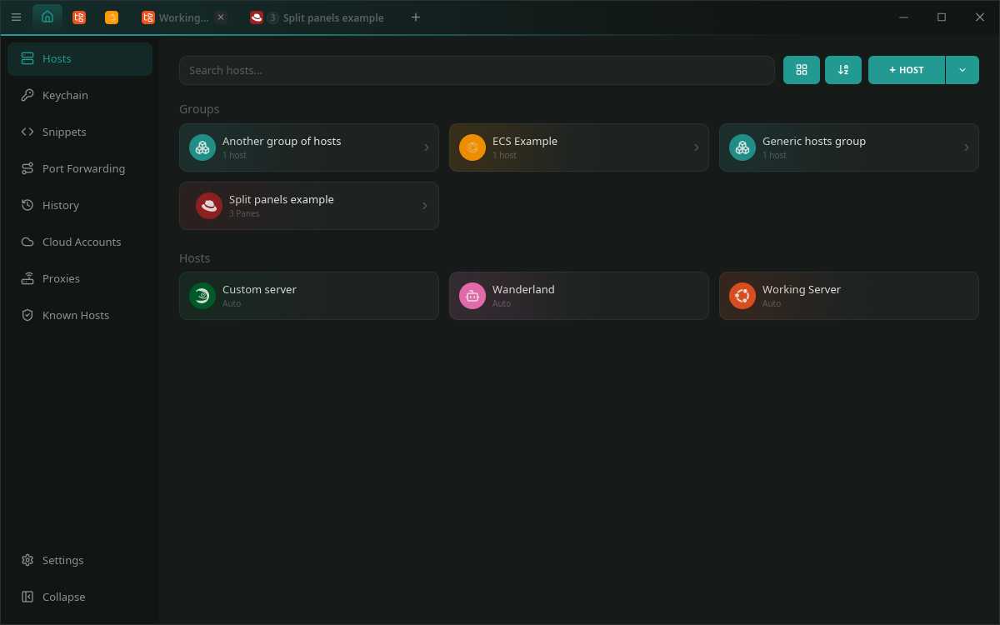
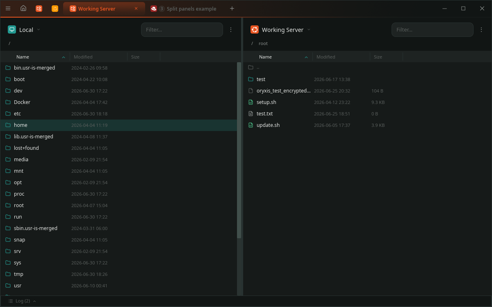
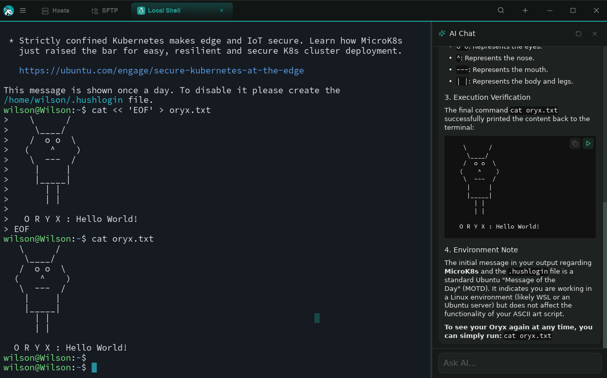
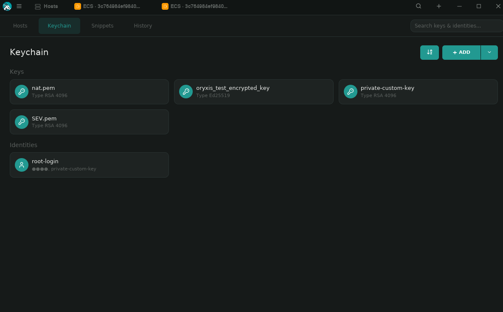
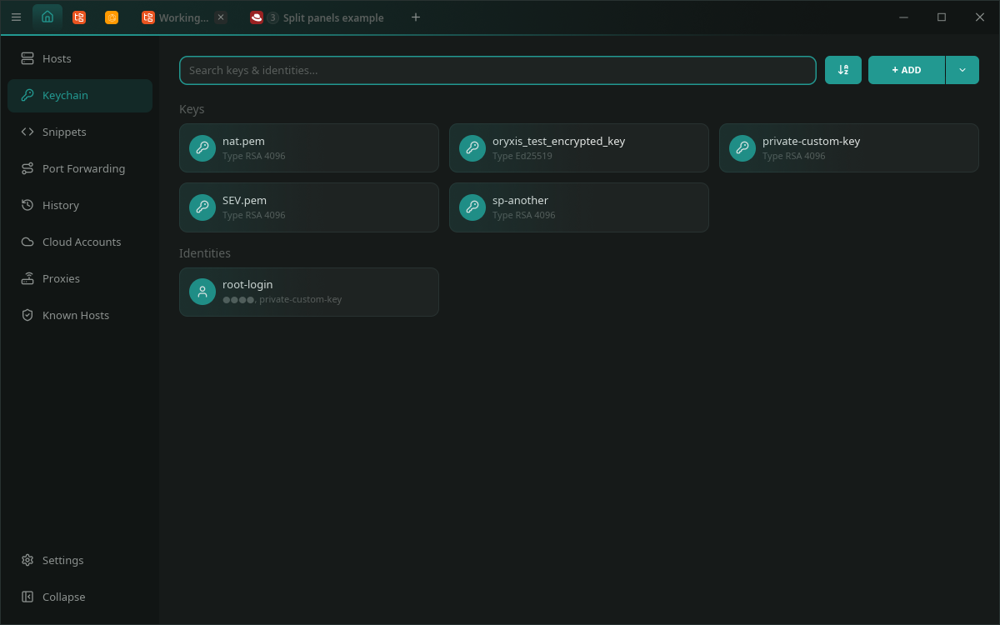
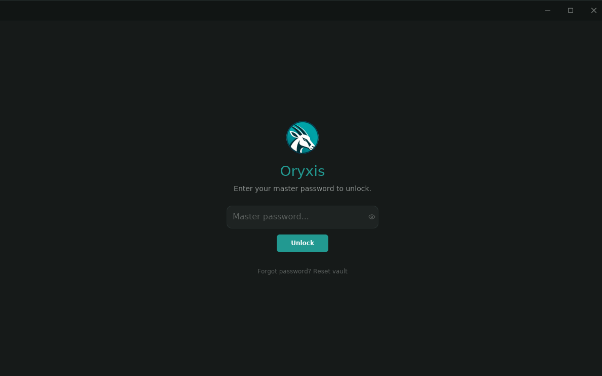
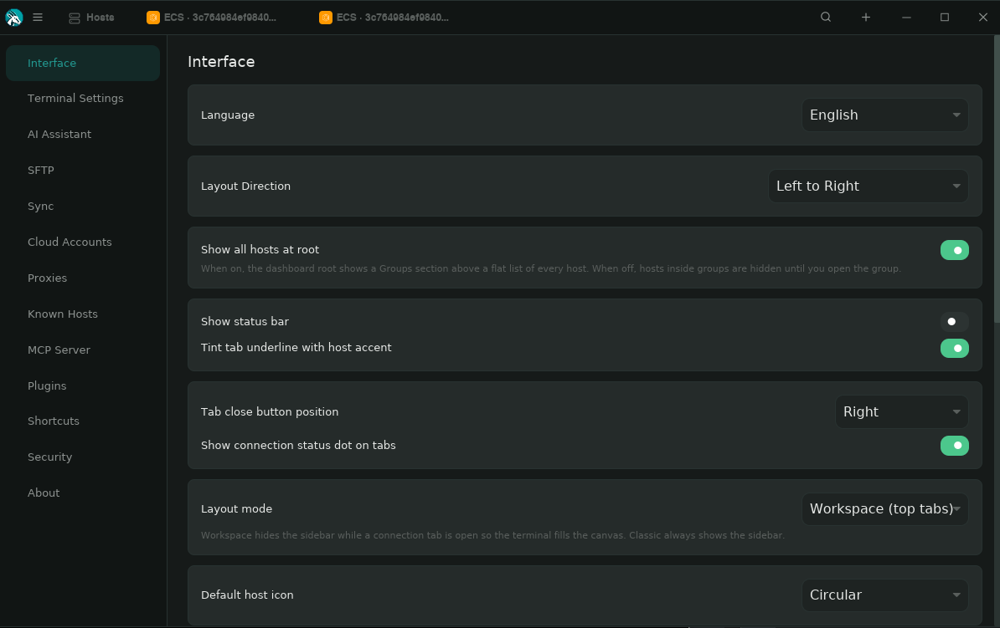

<p align="center">
  
</p>

<h1 align="center">Oryxis</h1>

<p align="center">
  A modern SSH client built entirely in Rust. Fast, encrypted, native.
</p>

<p align="center">
  English | <a href="README.zh-CN.md">简体中文</a> | <a href="README.zh-TW.md">繁體中文</a> | <a href="README.ja.md">日本語</a> | <a href="README.ko.md">한국어</a> | <a href="README.fa.md">فارسی</a> | <a href="README.pt-BR.md">Português (BR)</a>
</p>

<p align="center">
  <a href="https://github.com/wilsonglasser/oryxis/actions/workflows/ci.yml"></a>
  <a href="https://github.com/wilsonglasser/oryxis/releases/latest"></a>
  <a href="https://github.com/wilsonglasser/oryxis/releases"></a>
  
  <a href="LICENSE"></a>
  <a href="https://oryxis.app"></a>
  <a href="https://ko-fi.com/wilsonglasser"></a>
  <a href="https://buymeacoffee.com/wilsonglasser"></a>
</p>

<p align="center">
  
</p>

## What is Oryxis?

Oryxis is an open-source alternative to [Termius](https://termius.com/): a
desktop SSH client with a modern UI, an encrypted local vault for
credentials, and no cloud account anywhere in the loop. No Electron, no
webview, no vendor servers. Just a single native binary.

Most SSH clients make you pick two out of three: powerful but dated
(PuTTY), pretty but Electron-heavy (Termius, Tabby), or minimal and
terminal-only (OpenSSH). Oryxis aims at all three: **beautiful, fast, and
native**.

|  | Oryxis | Termius | PuTTY | Tabby |
|--|--------|---------|-------|-------|
| UI stack | Native Rust (iced + wgpu) | Electron | Native | Electron |
| License | AGPL-3.0, open source | Proprietary | MIT | MIT |
| Credential storage | Local encrypted vault | Vendor cloud account | None | Local config files |
| Device sync | P2P, E2E encrypted, optionally self-hosted relay | Vendor cloud (subscription) | None | Via Tabby Web |
| SFTP | Dual-pane GUI **and** an interactive console | Paid plan | CLI only | Basic panel |
| Price | Free | Free tier + subscription | Free | Free |

## Install

**Windows**

[](https://apps.microsoft.com/detail/9NTKPPSHBTG2)

or, from a terminal:

```powershell
winget install WilsonGlasser.Oryxis
```

**Arch Linux (AUR)**

```bash
yay -S oryxis-bin
```

**Direct downloads** from the [latest release](https://github.com/wilsonglasser/oryxis/releases/latest):

| Platform | Architecture | Download |
|----------|-------------|----------|
| Linux | x86_64 | [`.tar.gz`](https://github.com/wilsonglasser/oryxis/releases/latest/download/oryxis-linux-x86_64.tar.gz) · [`.deb`](https://github.com/wilsonglasser/oryxis/releases/latest/download/oryxis-linux-x86_64.deb) · [`.AppImage`](https://github.com/wilsonglasser/oryxis/releases/latest/download/oryxis-linux-x86_64.AppImage) |
| Linux | ARM64 | [`.tar.gz`](https://github.com/wilsonglasser/oryxis/releases/latest/download/oryxis-linux-aarch64.tar.gz) · [`.deb`](https://github.com/wilsonglasser/oryxis/releases/latest/download/oryxis-linux-aarch64.deb) · [`.AppImage`](https://github.com/wilsonglasser/oryxis/releases/latest/download/oryxis-linux-aarch64.AppImage) |
| macOS | Apple Silicon | [`.dmg`](https://github.com/wilsonglasser/oryxis/releases/latest/download/oryxis-macos-aarch64.dmg) · [`.tar.gz`](https://github.com/wilsonglasser/oryxis/releases/latest/download/oryxis-macos-aarch64.tar.gz) |
| Windows | x86_64 | [`setup.exe`](https://github.com/wilsonglasser/oryxis/releases/latest/download/oryxis-setup-x86_64.exe) · [`user-setup.exe`](https://github.com/wilsonglasser/oryxis/releases/latest/download/oryxis-user-setup-x86_64.exe) · [`.zip` portable](https://github.com/wilsonglasser/oryxis/releases/latest/download/oryxis-windows-x86_64.zip) |
| Windows | ARM64 | [`setup.exe`](https://github.com/wilsonglasser/oryxis/releases/latest/download/oryxis-setup-aarch64.exe) · [`user-setup.exe`](https://github.com/wilsonglasser/oryxis/releases/latest/download/oryxis-user-setup-aarch64.exe) · [`.zip` portable](https://github.com/wilsonglasser/oryxis/releases/latest/download/oryxis-windows-aarch64.zip) |

<details>
<summary><b>Which Windows installer?</b> (system vs per-user, VSCode-style)</summary>

- **System** (`oryxis-setup-*.exe`): installs to `Program Files`, registers
  under `HKLM`, requires UAC. Use this for shared machines or when all
  Windows users should share the install. This is the build
  `winget install` targets.
- **Per-user** (`oryxis-user-setup-*.exe`): installs to
  `%LOCALAPPDATA%\Programs\Oryxis`, registers under `HKCU`, no admin
  rights. Use this on locked-down machines or when you don't want UAC
  prompts on every update.

Both register `oryxis` and `oryxis-mcp` on `PATH` so they resolve from any
shell. The auto-updater detects the install scope and downloads the
matching installer. Windows binaries are Authenticode-signed (see
[Code signing policy](#code-signing-policy)).

</details>

## Highlights

- **Native and fast.** Pure Rust, GPU-accelerated [iced](https://iced.rs)
  UI, single binary. No Electron, no webview.
- **Encrypted local vault.** Argon2id + ChaCha20-Poly1305 per field,
  optional master password, biometric unlock (Windows Hello / Touch ID /
  Linux keyring), idle auto-lock, TOTP autofill for 2FA hosts, and
  stored passwords offered at `sudo` prompts (never sent on their own).
- **The full SSH pipeline.** Auto-auth, multi-hop jump chains, SOCKS /
  HTTP / command proxies, agent forwarding, standalone `-L`/`-R`/`-D` port
  forwarding, expect-style login scripts for menu-driven bastions
  (JumpServer and friends).
- **Bring your hosts along.** One import reads what you already have:
  `~/.ssh/config`, PuTTY, KiTTY, WinSCP, mRemoteNG, MobaXterm,
  SecureCRT, Xshell, FinalShell, Termius or any CSV. Pick the file
  (or the sessions folder) and the format is detected for you.
- **More than SSH.** Telnet and serial consoles for the gear that never
  learned SSH, raw TCP lines for console servers, ZMODEM transfers,
  local shells, and one-click RDP/VNC through an SSH tunnel.
- **Sessions that survive the network.** Switch mosh on for a host and
  the shell rides out sleep, a change of Wi-Fi and a change of address,
  with the interface saying how long the link has been out of touch
  rather than pretending it is fine. A native Rust client speaking the
  stock `mosh-server`'s protocol, so there is nothing extra to install
  on your machine.
- **A real terminal.** alacritty-based emulator, split panes, session
  groups, per-host themes, an optional translucent background or
  background image, bundled
  Nerd Fonts plus a downloadable font pack (JetBrains Mono, Fira Code,
  MesloLGS and more), smart tabs that flag long-running commands,
  per-host command history, and a per-host East Asian ambiguous-width
  setting so CJK TUIs line up.
- **Files everywhere.** Dual-pane SFTP with drag-and-drop, edit-in-place
  and server-to-server copy; every SSH tab also carries a Files sidebar
  that follows your shell's working directory. Prefer typing? An
  interactive SFTP console speaks `sftp(1)`'s commands (`get`, `put`,
  `mget`, `lcd`, globs, Tab completion, inline progress), opening as a
  pane of the session you are already in (stacked, beside or zoomed,
  your choice) with one switch between terminal, console and files.
- **Session recording.** Encrypted at rest; exports to asciinema `.cast`
  (theme embedded) or plain transcript, output-only by design.
- **The sysadmin toolbox.** An optional network tools panel (off by
  default, opens as its own tab): DNS records, ping, traceroute, TCP
  port test, HTTP redirect chain and certificate inspection, WHOIS, and
  the public spam blocklists.
- **Cloud accounts.** AWS, Google Cloud, Azure and Kubernetes discovery
  and connect (EC2, SSM, ECS Exec, GKE, AKS, `kubectl`), shipped as
  signed on-demand plugins.
- **AI where you work.** A per-tab assistant (bring your own key:
  Anthropic, OpenAI, Gemini, or compatible) with layered auto-exec safety,
  plus an [MCP server](docs/FEATURES.md#mcp-server) that exposes your
  hosts to AI clients like Claude Code.
- **P2P sync, no cloud.** End-to-end encrypted (X25519 +
  XChaCha20-Poly1305) over QUIC; mDNS on the LAN, optional
  [self-hosted](SELF_HOSTING.md) signaling/relay across networks. No
  account, no vendor server.
- **Keyboard-first.** `user@host` quick connect (Ctrl+K), MRU tab
  switching, full keyboard navigation down to the last toggle, every
  hotkey rebindable.
- **Private by design.** No telemetry, Privacy Mode masking, a paste guard
  that reads what you're pasting, and
  [23 languages](docs/FEATURES.md#themes--internationalization) with full
  RTL support: English, Português, Español, Français, Deutsch, Italiano,
  简体中文, 繁體中文, 日本語, Русский, فارسی, العربية, עברית, 한국어, Polski,
  Türkçe, Bahasa Indonesia, Tiếng Việt, Українська, ไทย, हिन्दी, Čeština,
  Ελληνικά.

The complete inventory lives in the **[feature tour](docs/FEATURES.md)**.
Using tmux? **[Logs and command history under tmux](docs/TMUX.md)**
explains what works out of the box and what you install yourself.
Want the file browser to track your shell exactly?
**[Following the shell's directory](docs/CWD.md)** has the snippet.
Getting a copy of your vault off this machine, into a cloud folder or
anywhere else? **[Backups and where to keep them](docs/BACKUP.md)**
covers sync, export, and the tools that carry a file the rest of the
way.

## Screenshots

Click any thumbnail for the full-size image.

<table>
  <tr>
    <td align="center" width="50%">
      <a href="resources/screen_1.png"></a>
      <br><em>Hosts dashboard: card grid, groups, distro auto-detection</em>
    </td>
    <td align="center" width="50%">
      <a href="resources/screen_2.png"></a>
      <br><em>Dual-pane SFTP: drag-and-drop, multi-select, edit-in-place</em>
    </td>
  </tr>
  <tr>
    <td align="center">
      <a href="resources/screen_3.png"></a>
      <br><em>Streaming AI sidebar with per-block Copy / Play</em>
    </td>
    <td align="center">
      <a href="resources/screen_4.png"></a>
      <br><em>Cloud Accounts: AWS / Kubernetes providers, multi-region fan-out</em>
    </td>
  </tr>
  <tr>
    <td align="center">
      <a href="resources/screen_5.png"></a>
      <br><em>Keychain: keys and reusable Identities side by side</em>
    </td>
    <td align="center">
      <a href="resources/screen_7.png"></a>
      <br><em>Terminal palettes with inline previews, plus custom schemes</em>
    </td>
  </tr>
  <tr>
    <td align="center" colspan="2">
      <a href="resources/screen_6.png"></a>
      <br><em>Settings → Interface: tab styling with live preview, app theme grid</em>
    </td>
  </tr>
</table>

## Quick start

1. **First launch:** choose a master password or continue without one
   (you can enable it, plus biometric unlock, later in Settings).
2. **Add hosts:** click `+ HOST`, or just type `user@host` (Ctrl+K) to
   connect without saving. Coming from another SSH client? Import
   brings its saved sessions over in one step.
3. **Connect:** click a host card. Split panes, the Files sidebar, SFTP
   and snippets are one keystroke away.
4. **Optional extras:** AI chat (Settings > AI), MCP server
   (Settings > Security, [setup guide](docs/FEATURES.md#mcp-server)),
   P2P sync between your devices (Settings > Sync,
   [self-hosting guide](SELF_HOSTING.md)).

Questions? Check the
[FAQ](https://github.com/wilsonglasser/oryxis/discussions/66) or open a
[Discussion](https://github.com/wilsonglasser/oryxis/discussions).

## Security

Everything sensitive is encrypted per-field at rest (Argon2id +
ChaCha20-Poly1305), host keys are TOFU-pinned, sync payloads are
end-to-end encrypted, plugins are Ed25519-signature-verified before
execution, and there is no telemetry of any kind.

The full security model and the vulnerability disclosure policy live in
[SECURITY.md](SECURITY.md). Please report vulnerabilities privately.

### Code signing policy

Free code signing provided by [SignPath.io](https://about.signpath.io),
certificate by [SignPath Foundation](https://signpath.org).

The Windows binaries and installers (`oryxis.exe`, `oryxis-setup-*.exe`,
`oryxis-user-setup-*.exe`) are Authenticode-signed in CI by SignPath. The
private key never leaves SignPath's hardware security module. No private
information is collected or shared as part of this process.

## Roadmap

Oryxis ships small and often (roughly weekly). This section is
forward-looking: items land incrementally as they are ready rather than
being tied to a specific version. Latest stable is **v0.16.0**;
[CHANGELOG.md](CHANGELOG.md) has the full history, and the
[roadmap discussion](https://github.com/wilsonglasser/oryxis/discussions/67)
tracks it interactively.

**Planned**

- **Multiple vaults:** keep separate encrypted vaults (Personal, Work)
  instead of one. Each has its own lock password, so isolation is real:
  two vaults never share a key. A unified unlock is offered for people
  who want the split for organization rather than secrecy, opening the
  linked ones together; that is a per-vault choice, not the default.
- **Native FIDO2:** talk to security keys directly (USB / NFC) for
  `sk-ssh-ed25519` / `sk-ecdsa-sk`, without delegating the touch to an
  external agent.
- **Vault & sync:** one-click relay deploy (the app installs
  `oryxis-relay` on a host from your vault over SSH, with the script
  shown before it runs).
- **China & CJK:** Alibaba Cloud (ECS) and Tencent Cloud (CVM)
  providers.
- **Offline mode:** one switch, offered at first run and in Settings,
  that stops Oryxis from making any request of its own. Update checks,
  font downloads and the plugin catalog go quiet; what still travels is
  what you asked for, the hosts you dial and the backends you
  configured yourself. One build, not a separate edition, so turning it
  off gives everything back. For machines that never had a network, an
  offline bundle download ships alongside the ordinary installer with
  the plugins and font packs already inside and the switch already on.
- **AI ops toolkit:** the assistant graduates from generating shell
  strings to typed, structured operations synthesized for the host's
  actual OS, with dry-run previews on every state change, an audit
  journal, and secrets structurally excluded from model context.
  Local-first, bring-your-own-key, no hosted backend.

**Exploring**

- **Team vaults over P2P sync:** share a vault with teammates with no
  hosted server; per-member key wrapping, re-key on member removal,
  optional self-hosted relay mailbox for teams never online together.
- **Multi-host AI agent:** the typed-operation agent detached from a
  single tab, investigating across vault hosts over ad-hoc SSH channels,
  gated by explicit per-host opt-in.
- **Storage browser plugins:** S3-compatible, SMB, and Chinese-cloud
  object storage (Huawei OBS / Tencent COS / Alibaba OSS) browsing as
  optional plugins on the existing signed-plugin pipeline.

## Building from source

Rust stable (via [rustup](https://rustup.rs/)), plus:

- **Linux:** `sudo apt install -y build-essential pkg-config libssl-dev libgtk-3-dev libwayland-dev libxkbcommon-dev`
- **macOS:** Xcode Command Line Tools (`xcode-select --install`)
- **Windows:** Visual Studio Build Tools with the C++ workload

```bash
git clone https://github.com/wilsonglasser/oryxis.git
cd oryxis
cargo run             # debug
cargo build --release # release
cargo test --workspace
```

The workspace layout is documented in
[docs/ARCHITECTURE.md](docs/ARCHITECTURE.md).

## Contributing

Contributions are welcome. Open an issue to discuss before starting large
PRs, and see [CONTRIBUTING.md](CONTRIBUTING.md) for the dev setup, quality
gates and project conventions (i18n, keyboard navigation, secret
handling).

## License

Copyright (C) 2026 Wilson Glasser. Licensed under
[AGPL-3.0-or-later](LICENSE). Free and open-source forever: anyone can
use, modify, and distribute Oryxis, but any modified version made
available over a network must also share its source code under the same
license. See [NOTICE](NOTICE) for details.

---

<p align="center">
  Built with Rust, for people who live in the terminal.
</p>
